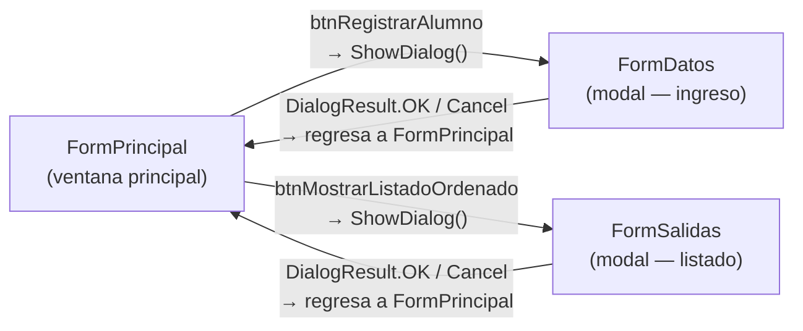
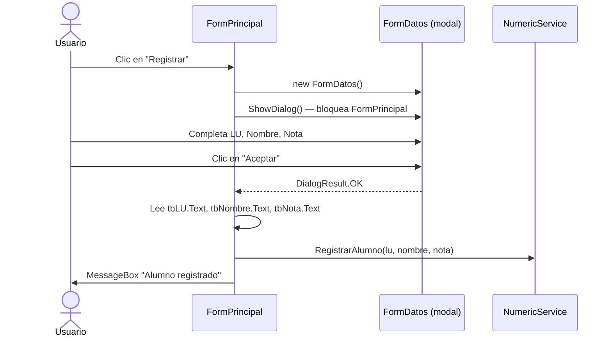

# Controles Windows Forms y Ventanas Modales

## Tabla de contenidos

1. [Introducción](#1-introducción)
2. [La clase Form — la ventana como clase](#2-la-clase-form--la-ventana-como-clase)
3. [Ventanas modales](#3-ventanas-modales)
4. [Controles](#4-controles)
   - 4.1 [Label](#41-label)
   - 4.2 [TextBox](#42-textbox)
   - 4.3 [Button](#43-button)
   - 4.4 [RadioButton](#44-radiobutton)
   - 4.5 [GroupBox](#45-groupbox)
   - 4.6 [ListBox](#46-listbox)
   - 4.7 [MessageBox](#47-messagebox)
5. [Jerarquía de controles](#5-jerarquía-de-controles)
6. [Eventos](#6-eventos)
7. [Conclusión — mapa completo de la solución](#7-conclusión--mapa-completo-de-la-solución)

---

## 1. Introducción

Una aplicación **Windows Forms** (WinForms) es un tipo de programa de escritorio en C# donde la interfaz de usuario se construye a partir de **ventanas** y **controles**. Cada ventana es una instancia de una clase que hereda de `Form`, y cada elemento visual dentro de ella —un botón, un campo de texto, una lista— es una instancia de un control específico.

El programador no dibuja píxeles: instancia objetos, configura sus propiedades y los agrega a la ventana. El sistema operativo se encarga de renderizarlos.

### La solución de esta actividad tiene tres ventanas



- **`FormPrincipal`** es la ventana que ve el usuario al iniciar el programa. Permanece abierta durante toda la sesión.
- **`FormDatos`** y **`FormSalidas`** son ventanas **modales**: aparecen encima de `FormPrincipal`, bloquean la interacción con ella hasta que el usuario las cierra, y luego devuelven un resultado.

---

## 2. La clase Form — la ventana como clase

### Concepto

En Windows Forms, **una ventana es una clase**. Crear una ventana nueva significa declarar una clase que hereda de `Form`:

```csharp
public partial class FormPrincipal : Form
{
    // ...
}
```

La palabra `partial` indica que la clase está dividida en dos archivos: el que el programador escribe (`FormPrincipal.cs`) y el que contiene la definición visual generada automáticamente (`FormPrincipal.Designer.cs`). El método `InitializeComponent()` —definido en el archivo Designer— crea e inicializa todos los controles del formulario.

### Propiedades de Form usadas en la solución

Estas propiedades se configuran en `InitializeComponent()` de cada formulario:

| Propiedad | Tipo | Qué controla | Ejemplo en la solución |
|---|---|---|---|
| `Text` | `string` | El título que aparece en la barra superior | `"Actividad 12."` / `"Mostrar Valor"` |
| `Name` | `string` | Nombre interno del control (para el diseñador) | `"FormPrincipal"` |
| `ClientSize` | `Size` | Tamaño interior de la ventana (sin bordes ni barra) | `new Size(390, 350)` en FormPrincipal |
| `FormBorderStyle` | `FormBorderStyle` | Estilo del borde; `FixedSingle` impide redimensionar | `FormBorderStyle.FixedSingle` |
| `MaximizeBox` | `bool` | Muestra u oculta el botón de maximizar | `false` en los tres formularios |
| `MinimizeBox` | `bool` | Muestra u oculta el botón de minimizar | `false` en FormDatos y FormSalidas |
| `StartPosition` | `FormStartPosition` | Posición inicial de la ventana al abrirse | Ver tabla siguiente |
| `Controls` | colección | Colección de controles contenidos en el formulario | `Controls.AddRange(...)` |
| `AcceptButton` | `IButtonControl` | Botón que se activa al presionar **Enter** | `this.AcceptButton = this.btnAceptar` |
| `CancelButton` | `IButtonControl` | Botón que se activa al presionar **Escape** | `this.CancelButton = this.btnCancelar` |

#### `StartPosition` en cada formulario

| Formulario | Valor | Efecto |
|---|---|---|
| `FormPrincipal` | `FormStartPosition.CenterScreen` | Se centra respecto a la pantalla completa |
| `FormDatos` | `FormStartPosition.CenterParent` | Se centra respecto a la ventana que la abrió |
| `FormSalidas` | `FormStartPosition.CenterParent` | Se centra respecto a la ventana que la abrió |

`CenterParent` es la elección natural para ventanas modales: visualmente aparecen "encima" de quien las invocó.

#### `FormBorderStyle.FixedSingle`

Usar `FormBorderStyle.FixedSingle` junto con `MaximizeBox = false` hace que la ventana tenga un tamaño fijo que el usuario no puede cambiar arrastrando los bordes. Esto es apropiado para formularios cuyo diseño está pensado para dimensiones exactas.

---

## 3. Ventanas modales

### Concepto

Una ventana **modal** es una ventana que, mientras está abierta, **impide interactuar con la ventana que la abrió**. El usuario debe responder antes de continuar.

Ejemplos cotidianos: el diálogo "¿Desea guardar los cambios?" al cerrar un archivo, o un formulario de inicio de sesión.

### `Show()` vs `ShowDialog()`

En Windows Forms existen dos formas de abrir un formulario:

| Método | Comportamiento |
|---|---|
| `Show()` | Abre la ventana y devuelve el control **inmediatamente**. Ambas ventanas existen en paralelo. |
| `ShowDialog()` | Abre la ventana y **espera** hasta que se cierre. Devuelve un `DialogResult`. |

En toda la solución se usa exclusivamente `ShowDialog()`, porque siempre es necesario saber qué decidió el usuario antes de continuar.

### `DialogResult` — el canal de comunicación

`DialogResult` es un valor que indica **cómo cerró el usuario la ventana modal**. El código que abrió el modal recibe ese valor al retornar `ShowDialog()`.

Los valores usados en la solución son:

| Valor | Significado |
|---|---|
| `DialogResult.OK` | El usuario confirmó (presionó "Aceptar") |
| `DialogResult.Cancel` | El usuario canceló (presionó "Cancelar" o cerró la ventana) |

#### Cómo se asigna en los botones

En `FormDatos.Designer.cs`, cada botón tiene su `DialogResult` configurado directamente en la propiedad:

```csharp
this.btnAceptar.DialogResult  = DialogResult.OK;
this.btnCancelar.DialogResult = DialogResult.Cancel;
```

Cuando el usuario hace clic en cualquiera de estos botones, el formulario modal **se cierra automáticamente** y `ShowDialog()` devuelve el valor correspondiente. No hace falta escribir código adicional para cerrarlo.

#### Cómo se lee en `FormPrincipal`

```csharp
private void btnRegistrarAlumno_Click(object sender, EventArgs e)
{
    FormDatos formDatos = new FormDatos();

    if (formDatos.ShowDialog() == DialogResult.OK)
    {
        // el usuario presionó Aceptar → se leen los datos ingresados
        string nombre = formDatos.tbNombre.Text;
        // ...
    }
    // si el usuario canceló, no se hace nada
}
```

El `if` sobre `ShowDialog()` es el patrón estándar: solo se procesan los datos si el usuario confirmó.

### `AcceptButton` y `CancelButton`

Asignar estas propiedades en el formulario modal conecta las teclas **Enter** y **Escape** con botones específicos, sin necesidad de manejar eventos de teclado manualmente:

```csharp
// En FormDatos y FormSalidas:
this.AcceptButton = this.btnAceptar;   // Enter → clic en btnAceptar → DialogResult.OK
this.CancelButton = this.btnCancelar;  // Escape → clic en btnCancelar → DialogResult.Cancel
```

Esto mejora la usabilidad: el usuario puede confirmar con Enter o cancelar con Escape de forma natural.

---

## 4. Controles

Un **control** es cualquier elemento visual que puede colocarse en un formulario: botones, campos de texto, listas, etc. Todos los controles heredan de la clase base `Control`, lo que les da propiedades comunes como `Location`, `Size` y `Text`.

> **Convención de nomenclatura usada en la solución:**
> Los controles se nombran con un prefijo que indica su tipo: `tb` (TextBox), `btn` (Button), `rb` (RadioButton), `lsb` (ListBox), `lb` o sin prefijo (Label), `groupBox` (GroupBox).

---

### 4.1 Label

#### Concepto

Un `Label` muestra texto **informativo** que el usuario no puede modificar. Su función es etiquetar otros controles: indica qué dato se espera ingresar en el campo de al lado.

#### Propiedades usadas

| Propiedad | Tipo | Qué controla |
|---|---|---|
| `Text` | `string` | El texto visible |
| `Location` | `Point` | Posición (x, y) dentro del contenedor |
| `AutoSize` | `bool` | Si es `true`, el control se ajusta al tamaño del texto automáticamente |

#### En la solución

En `FormDatos` se usan tres labels para identificar cada campo de entrada:

```csharp
// label1 — etiqueta del campo LU
this.label1.AutoSize = true;
this.label1.Location = new Point(20, 20);
this.label1.Text = "LU:";

// label2 — etiqueta del campo Nombre
this.label2.AutoSize = true;
this.label2.Location = new Point(20, 55);
this.label2.Text = "Nombre:";

// label3 — etiqueta del campo Nota
this.label3.AutoSize = true;
this.label3.Location = new Point(20, 90);
this.label3.Text = "Nota:";
```

`AutoSize = true` permite escribir el texto sin preocuparse por el ancho del control: se ajusta solo.

---

### 4.2 TextBox

#### Concepto

Un `TextBox` es un campo donde el usuario puede **escribir texto**. Es el control de entrada de datos más fundamental. Su contenido siempre se lee como `string` a través de la propiedad `Text`.

#### Propiedades usadas

| Propiedad | Tipo | Qué controla |
|---|---|---|
| `Location` | `Point` | Posición (x, y) dentro del contenedor |
| `Size` | `Size` | Ancho y alto del campo en píxeles |
| `Text` | `string` | El texto ingresado por el usuario (lectura y escritura) |

#### En la solución

`FormDatos` tiene tres TextBox, uno por cada dato del alumno:

```csharp
this.tbLU.Location     = new Point(100, 17);
this.tbLU.Size         = new Size(160, 23);

this.tbNombre.Location = new Point(100, 52);
this.tbNombre.Size     = new Size(160, 23);

this.tbNota.Location   = new Point(100, 87);
this.tbNota.Size       = new Size(160, 23);
```

`FormPrincipal` tiene un TextBox adicional (`tbLU`) para ingresar el LU que se desea buscar.

#### Lectura del valor en `FormPrincipal`

Como `tbLU`, `tbNombre` y `tbNota` en `FormDatos` son declarados como `public`, `FormPrincipal` puede leerlos directamente después de que el modal cierra:

```csharp
// FormDatos.Designer.cs — declarados públicos para que FormPrincipal los lea
public TextBox tbLU     = null!;
public TextBox tbNombre = null!;
public TextBox tbNota   = null!;
```

```csharp
// FormPrincipal.cs — lectura después de ShowDialog()
string nombre = formDatos.tbNombre.Text;
int    lu     = Convert.ToInt32(formDatos.tbLU.Text);
double nota   = Convert.ToDouble(formDatos.tbNota.Text);
```

`Text` siempre es `string`, por eso es necesario convertir los valores numéricos con `Convert.ToInt32` y `Convert.ToDouble`.

---

### 4.3 Button

#### Concepto

Un `Button` es un control que el usuario puede **presionar** para desencadenar una acción. Cuando se hace clic, se dispara su evento `Click`. En ventanas modales, la propiedad `DialogResult` determina qué valor devuelve `ShowDialog()` al presionarlo.

#### Propiedades usadas

| Propiedad | Tipo | Qué controla |
|---|---|---|
| `Location` | `Point` | Posición dentro del contenedor |
| `Size` | `Size` | Ancho y alto |
| `Text` | `string` | La leyenda visible en el botón |
| `DialogResult` | `DialogResult` | Valor que cierra el modal y se devuelve a `ShowDialog()` |
| evento `Click` | `EventHandler` | Método que se ejecuta cuando el usuario hace clic |

#### Botones en `FormPrincipal` — usan el evento `Click`

```csharp
this.btnRegistrarAlumno.Text   = "Registrar";
this.btnRegistrarAlumno.Click += new EventHandler(this.btnRegistrarAlumno_Click);

this.btnBuscarYVerAlumno.Text  = "Buscar";
this.btnBuscarYVerAlumno.Click += new EventHandler(this.btnBuscarAlumno_Click);

this.btnMostrarListadoOrdenado.Text  = "Listar Ordenado";
this.btnMostrarListadoOrdenado.Click += new EventHandler(this.btnMostrarListadoOrdenado_Click);
```

#### Botones en `FormDatos` y `FormSalidas` — usan `DialogResult`

```csharp
// En FormDatos y FormSalidas (idéntico en ambos)
this.btnAceptar.DialogResult  = DialogResult.OK;
this.btnAceptar.Text          = "Aceptar";

this.btnCancelar.DialogResult = DialogResult.Cancel;
this.btnCancelar.Text         = "Cancelar";
```

Estos botones **no tienen evento `Click`** asignado manualmente. Al tener `DialogResult` configurado, Windows Forms cierra el modal automáticamente al presionarlos.

#### La diferencia conceptual

- Un botón con `Click` ejecuta lógica y **no cierra nada** por sí mismo.
- Un botón con `DialogResult` cierra el modal **inmediatamente** y devuelve ese valor a quien lo abrió.

---

### 4.4 RadioButton

#### Concepto

Un `RadioButton` representa una opción dentro de un grupo donde **solo una puede estar seleccionada a la vez**. Cuando el usuario selecciona uno, los demás del mismo grupo se desmarcan automáticamente.

El agrupamiento es automático: todos los RadioButtons que comparten el mismo **contenedor** (un GroupBox, o el propio formulario) forman un grupo mutuamente excluyente.

#### Propiedades usadas

| Propiedad | Tipo | Qué controla |
|---|---|---|
| `Location` | `Point` | Posición dentro del contenedor |
| `AutoSize` | `bool` | Ajuste automático al tamaño del texto |
| `Text` | `string` | La etiqueta visible junto al círculo |
| `Checked` | `bool` | Si está seleccionado (`true`) o no (`false`) |

#### En la solución — dos grupos independientes

`FormPrincipal` tiene cuatro RadioButtons distribuidos en dos GroupBox distintos, formando dos grupos independientes:

**Grupo de búsqueda** (dentro de `groupBox2`):

```csharp
this.rbSecuencial.Text    = "Secuencial";
this.rbSecuencial.Checked = true;     // seleccionado por defecto

this.rbBinaria.Text       = "Binaria";
// Checked es false por defecto
```

**Grupo de ordenamiento** (dentro de `groupBox3`):

```csharp
this.rbBurbuja.Text    = "Burbuja";
this.rbBurbuja.Checked = true;        // seleccionado por defecto

this.rbQuickSort.Text  = "QuickSort";
// Checked es false por defecto
```

Como cada par está en un GroupBox diferente, seleccionar "Burbuja" no afecta al grupo de búsqueda, y viceversa.

#### Lectura del valor seleccionado en `FormPrincipal`

```csharp
// Para determinar el método de búsqueda
int metodo;
if (rbSecuencial.Checked)
    metodo = 0;
else
    metodo = 1;

// Para determinar el método de ordenamiento
if (rbBurbuja.Checked)
    metodo = 0;
else
    metodo = 1;
```

Se lee el RadioButton que se espera que sea `true`. No hace falta leer todos: si el primero no está marcado, el segundo lo estará (en un grupo de dos opciones).

---

### 4.5 GroupBox

#### Concepto

Un `GroupBox` es un **contenedor visual** que agrupa controles relacionados. Dibuja un rectángulo con un título en la esquina superior izquierda. Además de organizar visualmente la interfaz, tiene un efecto funcional importante: los RadioButtons dentro de un GroupBox forman su propio grupo independiente.

> Un GroupBox no es simplemente decorativo: **define el espacio de exclusión mutua** de los RadioButtons que contiene.

#### Propiedades usadas

| Propiedad | Tipo | Qué controla |
|---|---|---|
| `Location` | `Point` | Posición dentro del formulario |
| `Size` | `Size` | Ancho y alto del rectángulo |
| `Text` | `string` | El título visible en el borde superior |
| `Controls` | colección | Los controles hijos contenidos dentro |

#### En la solución

`FormPrincipal` usa tres GroupBox para separar las tres áreas funcionales:

```csharp
// groupBox1 — área de registro
this.groupBox1.Location = new Point(12, 12);
this.groupBox1.Size     = new Size(360, 70);
this.groupBox1.Text     = "Solicitud datos alumno";
this.groupBox1.Controls.Add(this.btnRegistrarAlumno);

// groupBox2 — área de búsqueda
this.groupBox2.Location = new Point(12, 95);
this.groupBox2.Size     = new Size(360, 110);
this.groupBox2.Text     = "Salidas";
this.groupBox2.Controls.AddRange(new Control[] {
    this.tbLU, this.btnBuscarYVerAlumno, this.rbSecuencial, this.rbBinaria
});

// groupBox3 — área de listado ordenado
this.groupBox3.Location = new Point(12, 220);
this.groupBox3.Size     = new Size(360, 110);
this.groupBox3.Text     = "Salidas";
this.groupBox3.Controls.AddRange(new Control[] {
    this.btnMostrarListadoOrdenado, this.rbBurbuja, this.rbQuickSort
});
```

Los controles se agregan a la colección `Controls` **del GroupBox**, no a la del formulario. El formulario solo agrega los GroupBox a su propia colección.

---

### 4.6 ListBox

#### Concepto

Un `ListBox` muestra una **lista de elementos de texto**, uno por línea. El usuario puede desplazarse por ella con la barra de scroll que aparece automáticamente cuando los ítems no caben. En esta solución se usa para mostrar el listado de alumnos ordenados.

#### Propiedades usadas

| Propiedad / Método | Tipo | Qué controla |
|---|---|---|
| `Location` | `Point` | Posición dentro del formulario |
| `Size` | `Size` | Ancho y alto del área visible |
| `Items.Add(texto)` | método | Agrega una línea de texto a la lista |

#### En la solución

`FormSalidas` contiene un ListBox declarado como `public` para que `FormPrincipal` pueda llenarlo antes de mostrar el modal:

```csharp
// FormSalidas.Designer.cs
public ListBox lsbListado = null!;

this.lsbListado.Location = new Point(12, 12);
this.lsbListado.Size     = new Size(360, 200);
```

`FormPrincipal` lo rellena en un bucle antes de abrir el modal:

```csharp
private void btnMostrarListadoOrdenado_Click(object sender, EventArgs e)
{
    // 1. ordena los datos en el servicio
    servicio.OrdenarPorLU(metodo);

    // 2. crea el formulario modal
    FormSalidas formSalidas = new FormSalidas();

    // 3. agrega cada alumno como una línea al ListBox
    for (int i = 0; i < servicio.Contador; i++)
        formSalidas.lsbListado.Items.Add(servicio.VerAlumno(i));

    // 4. muestra el modal — el usuario ve la lista
    formSalidas.ShowDialog();
}
```

`Items.Add` recibe un `string` y lo agrega al final de la lista. El `ListBox` muestra automáticamente una barra de scroll vertical si los ítems superan el alto visible.

---

### 4.7 MessageBox

#### Concepto

`MessageBox` es un diálogo de sistema **predefinido** para mostrar mensajes al usuario. A diferencia de los demás controles, no se instancia ni se agrega a ningún formulario: se invoca directamente con el método estático `MessageBox.Show(...)`.

Es siempre modal: bloquea la aplicación hasta que el usuario hace clic en el botón del diálogo.

#### Firma usada en la solución

```csharp
MessageBox.Show(
    texto,          // string — el mensaje principal
    título,         // string — el título de la ventana del diálogo
    MessageBoxButtons.OK,              // qué botones mostrar
    MessageBoxIcon.Information         // qué ícono mostrar
);
```

#### Variantes de `MessageBoxButtons` e `MessageBoxIcon` usadas

| Parámetro | Valor usado | Efecto |
|---|---|---|
| `MessageBoxButtons` | `MessageBoxButtons.OK` | Muestra un único botón "Aceptar" |
| `MessageBoxIcon` | `MessageBoxIcon.Information` | Ícono de información (círculo azul con "i") |
| `MessageBoxIcon` | `MessageBoxIcon.Error` | Ícono de error (círculo rojo con "×") |

#### En la solución — tres usos concretos

**Confirmación de registro exitoso:**
```csharp
MessageBox.Show(
    "Alumno registrado. Total: " + servicio.Contador,
    "Info",
    MessageBoxButtons.OK,
    MessageBoxIcon.Information
);
```

**Alumno no encontrado:**
```csharp
MessageBox.Show(
    "Alumno con LU " + lu + " no encontrado.",
    "Búsqueda",
    MessageBoxButtons.OK,
    MessageBoxIcon.Information
);
```

**Error de conversión (LU o Nota inválidos):**
```csharp
MessageBox.Show(
    "LU inválido.",
    "Error",
    MessageBoxButtons.OK,
    MessageBoxIcon.Error
);
```

El patrón es siempre el mismo: mensaje descriptivo, título breve, botón único de confirmación, ícono acorde a la situación.

---

## 5. Jerarquía de controles

Cada control en Windows Forms tiene un **contenedor padre**. Al agregar un control a un contenedor, ese control queda visualmente dentro de él y su `Location` se calcula **relativo** a la esquina superior izquierda del contenedor, no de la pantalla.

### `Controls.Add` y `Controls.AddRange`

Todos los contenedores (`Form`, `GroupBox`) exponen una colección `Controls` con dos métodos principales:

```csharp
// Agrega un único control
this.groupBox1.Controls.Add(this.btnRegistrarAlumno);

// Agrega varios controles en una sola llamada
this.groupBox2.Controls.AddRange(new Control[] {
    this.tbLU,
    this.btnBuscarYVerAlumno,
    this.rbSecuencial,
    this.rbBinaria
});
```

`AddRange` recibe un arreglo de `Control`. Es exactamente un vector de objetos polimórficos: `TextBox`, `Button` y `RadioButton` son todos `Control`, por lo que pueden coexistir en el mismo arreglo.

### Jerarquía en `FormPrincipal`

```
FormPrincipal
 ├── groupBox1  ("Solicitud datos alumno")
 │    └── btnRegistrarAlumno
 ├── groupBox2  ("Salidas" — búsqueda)
 │    ├── lblLU
 │    ├── tbLU
 │    ├── btnBuscarYVerAlumno
 │    ├── rbSecuencial
 │    └── rbBinaria
 └── groupBox3  ("Salidas" — listado)
      ├── btnMostrarListadoOrdenado
      ├── rbBurbuja
      └── rbQuickSort
```

### Jerarquía en `FormDatos`

```
FormDatos
 ├── label1 ("LU:")
 ├── tbLU
 ├── label2 ("Nombre:")
 ├── tbNombre
 ├── label3 ("Nota:")
 ├── tbNota
 ├── btnAceptar
 └── btnCancelar
```

### Jerarquía en `FormSalidas`

```
FormSalidas
 ├── lsbListado
 ├── btnAceptar
 └── btnCancelar
```

`FormDatos` y `FormSalidas` no usan GroupBox: sus controles van directamente al formulario porque son ventanas simples con una única función.

---

## 6. Eventos

### Concepto

Un **evento** es una notificación que un control emite cuando algo ocurre: el usuario hizo clic, presionó una tecla, cerró la ventana. El programador **suscribe** un método propio al evento para que se ejecute automáticamente cuando ocurra.

El evento más usado en la solución es `Click` del `Button`.

### Cómo se suscribe un evento

En `InitializeComponent()`, la suscripción se escribe con el operador `+=`:

```csharp
this.btnRegistrarAlumno.Click += new EventHandler(this.btnRegistrarAlumno_Click);
```

Esto significa: "cuando `btnRegistrarAlumno` emita el evento `Click`, ejecutá el método `btnRegistrarAlumno_Click`".

### La firma del manejador de evento

Todo método que maneja un evento de tipo `EventHandler` debe tener exactamente esta firma:

```csharp
private void btnRegistrarAlumno_Click(object sender, EventArgs e)
{
    // lógica a ejecutar cuando se hace clic
}
```

| Parámetro | Tipo | Qué contiene |
|---|---|---|
| `sender` | `object` | El control que disparó el evento (en este caso, `btnRegistrarAlumno`) |
| `e` | `EventArgs` | Información adicional sobre el evento (en `Click` básico, no se usa) |

En la solución, `sender` y `e` no se usan dentro del cuerpo del método porque no se necesita saber cuál botón exacto disparó el evento (cada botón tiene su propio manejador).

### Los tres manejadores en `FormPrincipal`

```csharp
// Abre FormDatos como modal y registra el alumno si el usuario confirmó
private void btnRegistrarAlumno_Click(object sender, EventArgs e) { ... }

// Lee tbLU, determina el método de búsqueda y muestra el resultado con MessageBox
private void btnBuscarAlumno_Click(object sender, EventArgs e) { ... }

// Ordena, llena el ListBox de FormSalidas y lo muestra como modal
private void btnMostrarListadoOrdenado_Click(object sender, EventArgs e) { ... }
```

Cada botón tiene su propio método. Esto es consecuencia directa del diseño orientado a eventos: **el formulario reacciona a acciones del usuario, no las anticipa**.

---

## 7. Conclusión — mapa completo de la solución

### Tabla de controles por formulario

| Formulario | Control | Nombre en código | Propósito |
|---|---|---|---|
| `FormPrincipal` | `GroupBox` | `groupBox1` | Agrupa el botón de registro |
| `FormPrincipal` | `GroupBox` | `groupBox2` | Agrupa los controles de búsqueda |
| `FormPrincipal` | `GroupBox` | `groupBox3` | Agrupa los controles de listado |
| `FormPrincipal` | `Button` | `btnRegistrarAlumno` | Abre `FormDatos` como modal |
| `FormPrincipal` | `Button` | `btnBuscarYVerAlumno` | Busca un alumno por LU |
| `FormPrincipal` | `Button` | `btnMostrarListadoOrdenado` | Ordena y abre `FormSalidas` |
| `FormPrincipal` | `TextBox` | `tbLU` | LU a buscar |
| `FormPrincipal` | `Label` | `lblLU` | Etiqueta del campo tbLU |
| `FormPrincipal` | `RadioButton` | `rbSecuencial` | Selecciona búsqueda secuencial |
| `FormPrincipal` | `RadioButton` | `rbBinaria` | Selecciona búsqueda binaria |
| `FormPrincipal` | `RadioButton` | `rbBurbuja` | Selecciona ordenamiento burbuja |
| `FormPrincipal` | `RadioButton` | `rbQuickSort` | Selecciona ordenamiento QuickSort |
| `FormDatos` | `Label` | `label1` | Etiqueta "LU:" |
| `FormDatos` | `Label` | `label2` | Etiqueta "Nombre:" |
| `FormDatos` | `Label` | `label3` | Etiqueta "Nota:" |
| `FormDatos` | `TextBox` | `tbLU` | Campo de ingreso del LU |
| `FormDatos` | `TextBox` | `tbNombre` | Campo de ingreso del nombre |
| `FormDatos` | `TextBox` | `tbNota` | Campo de ingreso de la nota |
| `FormDatos` | `Button` | `btnAceptar` | Confirma → `DialogResult.OK` |
| `FormDatos` | `Button` | `btnCancelar` | Cancela → `DialogResult.Cancel` |
| `FormSalidas` | `ListBox` | `lsbListado` | Muestra el listado de alumnos |
| `FormSalidas` | `Button` | `btnAceptar` | Confirma → `DialogResult.OK` |
| `FormSalidas` | `Button` | `btnCancelar` | Cancela → `DialogResult.Cancel` |
| Cualquiera | `MessageBox` | — (estático) | Mensajes de error e información |

### Flujo completo de la operación "Registrar alumno"



### La progresión de conceptos en esta solución

```
Form          → la ventana es una clase con propiedades y métodos
Controls      → cada elemento visual es un objeto que se agrega a un contenedor
Eventos       → el código responde a acciones del usuario, no las anticipa
Modal         → ShowDialog() espera; DialogResult comunica la decisión
GroupBox      → los contenedores organizan la interfaz y definen grupos de RadioButtons
MessageBox    → diálogo de sistema sin instanciación: la forma más simple de feedback
```

Cada concepto se apoya en el anterior. Comprender que una ventana es una clase, que los controles son objetos y que los eventos son el mecanismo de comunicación entre el usuario y el programa es la base sobre la que se construye cualquier aplicación de escritorio en C#.
