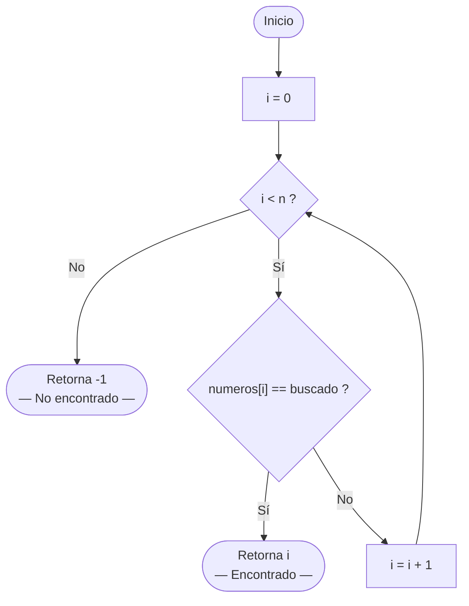
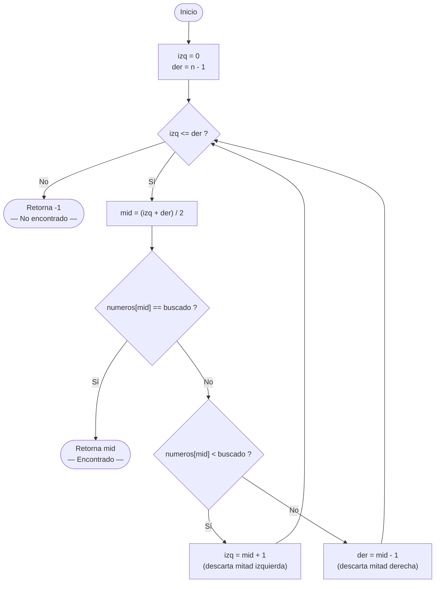
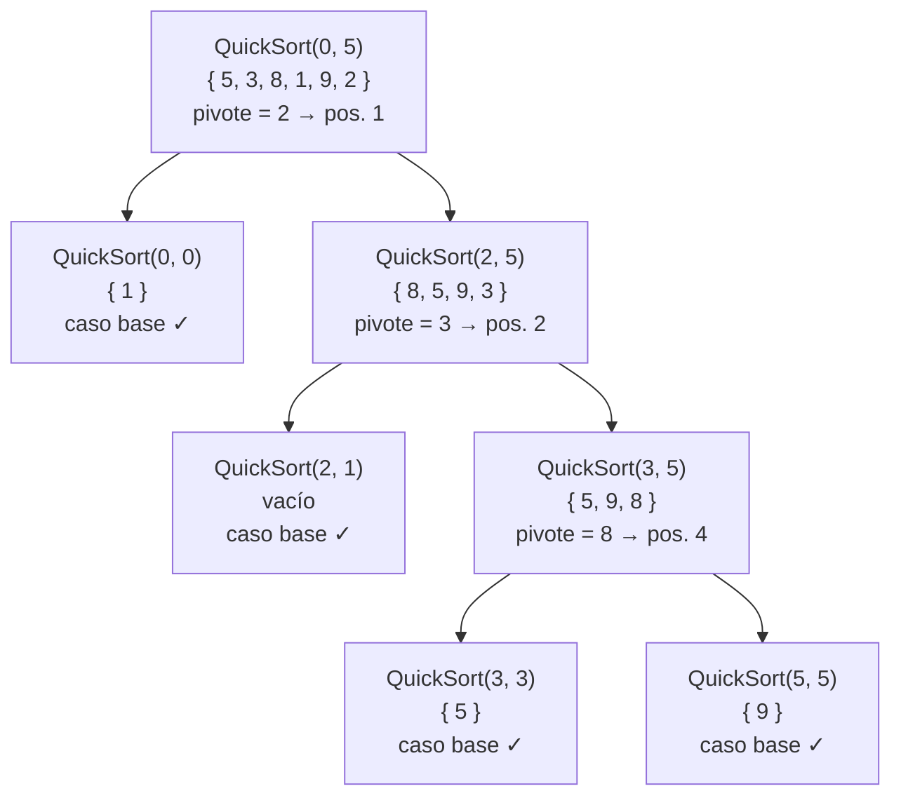

# Algoritmos de Búsqueda y Ordenamiento

## Tabla de contenidos

1. [Introducción](#1-introducción)
2. [Búsqueda Secuencial](#2-búsqueda-secuencial)
3. [Búsqueda Binaria](#3-búsqueda-binaria)
4. [Comparación: Búsqueda Secuencial vs. Binaria](#4-comparación-búsqueda-secuencial-vs-binaria)
5. [Ordenamiento Burbuja](#5-ordenamiento-burbuja)
6. [Ordenamiento QuickSort](#6-ordenamiento-quicksort)
7. [Comparación: Burbuja vs. QuickSort](#7-comparación-burbuja-vs-quicksort)
8. [Conclusión](#8-conclusión)

---

## 1. Introducción

Dos operaciones aparecen constantemente en cualquier programa que trabaje con colecciones de datos: **buscar** un elemento y **ordenar** la colección.

- **Buscar** significa recorrer una colección para localizar un valor específico y conocer su posición.
- **Ordenar** significa reorganizar los elementos de una colección según un criterio (generalmente de menor a mayor).

Estas operaciones no son independientes: como se verá en la sección 3, el algoritmo de búsqueda más eficiente (Búsqueda Binaria) **exige** que la colección esté previamente ordenada. Comprender los algoritmos de búsqueda primero, y luego los de ordenamiento, permite entender por qué el ordenamiento existe y cuándo vale la pena aplicarlo.

### El vector de referencia

Para seguir todos los ejemplos de este documento se usa **siempre el mismo vector** de seis enteros:

```csharp
int[] numeros = { 5, 3, 8, 1, 9, 2 };
int n = 6; // cantidad de elementos válidos
```

Los índices van del `0` al `5`. El valor buscado en los ejemplos de búsqueda es siempre el **8**, que se encuentra en la posición `2`.

---

## 2. Búsqueda Secuencial

### Objetivo conceptual

La búsqueda secuencial responde a una pregunta simple: **¿está el valor `buscado` en alguna posición del vector?**

La estrategia es la más directa posible: empezar desde el principio y revisar cada elemento uno por uno hasta encontrar el valor o agotar el vector. No hace ninguna suposición sobre el orden de los elementos.

> **Idea central:** si recorro todos los elementos y ninguno coincide, el valor no está.

El costo de esta búsqueda depende de cuántos elementos hay: en el peor caso (el valor no existe o está al final) se revisan **todos** los elementos.

### Código en C#

```csharp
public static int BuscarSecuencial(int[] numeros, int n, int buscado)
{
    for (int i = 0; i < n; i++)
    {
        if (numeros[i] == buscado)
            return i;       // retorna la posición donde lo encontró
    }
    return -1;              // retorna -1 si no lo encontró
}
```

El método retorna el **índice** del elemento encontrado, o `-1` si no existe. Esta convención (retornar `-1` como "no encontrado") es la misma utilizada en `NumericService` de ambos ejercicios.

### Seguimiento paso a paso

Vector: `{ 5, 3, 8, 1, 9, 2 }` — buscamos el **8**

| Paso | i | `numeros[i]` | ¿Es igual a 8? | Acción |
|:---:|:---:|:---:|:---:|---|
| 1 | 0 | 5 | No | Continúa |
| 2 | 1 | 3 | No | Continúa |
| 3 | 2 | 8 | **Sí** | Retorna `2` |

El algoritmo encontró el **8** en la posición `2` tras revisar 3 elementos.

**Caso: valor no encontrado** — buscamos el **7**

| Paso | i | `numeros[i]` | ¿Es igual a 7? | Acción |
|:---:|:---:|:---:|:---:|---|
| 1 | 0 | 5 | No | Continúa |
| 2 | 1 | 3 | No | Continúa |
| 3 | 2 | 8 | No | Continúa |
| 4 | 3 | 1 | No | Continúa |
| 5 | 4 | 9 | No | Continúa |
| 6 | 5 | 2 | No | Continúa |
| — | — | — | — | Retorna `-1` |

En este caso se revisaron los **6 elementos** antes de concluir que el valor no existe.

### Diagrama de flujo



### Observaciones clave

- No requiere ninguna condición previa sobre el vector (puede estar desordenado).
- En el **mejor caso** (el elemento está en la posición 0) se hace **1 comparación**.
- En el **peor caso** (el elemento no existe) se hacen **n comparaciones**.
- Es el único algoritmo aplicable cuando el vector **no está ordenado** y no queremos ordenarlo.

---

## 3. Búsqueda Binaria

### Objetivo conceptual

La búsqueda binaria responde a la misma pregunta que la secuencial —¿está el valor en el vector?— pero aprovechando una característica crucial: el vector **está ordenado de menor a mayor**.

> **Idea central:** si el vector está ordenado, al inspeccionar el elemento del medio puedo saber en qué mitad debe estar el valor buscado y descartar la otra mitad por completo. En cada paso, el espacio de búsqueda se **divide a la mitad**.

Imagine buscar una palabra en un diccionario: nadie lee desde la página 1. Se abre por el medio y se decide si la palabra está antes o después. La búsqueda binaria aplica exactamente esa lógica.

**Prerequisito obligatorio:** el vector debe estar **ordenado** antes de invocar este algoritmo. Si no lo está, los resultados son incorrectos.

### Código en C#

```csharp
public static int BuscarBinario(int[] numeros, int n, int buscado)
{
    int izq = 0;
    int der = n - 1;

    while (izq <= der)
    {
        int mid = (izq + der) / 2;

        if (numeros[mid] == buscado)
            return mid;             // encontrado en la posición mid

        if (numeros[mid] < buscado)
            izq = mid + 1;          // el valor está en la mitad derecha
        else
            der = mid - 1;          // el valor está en la mitad izquierda
    }

    return -1;                      // izq > der: el valor no existe
}
```

Las variables `izq` y `der` delimitan el **segmento activo** del vector (la región donde todavía puede estar el valor). Al comenzar, ese segmento cubre todo el vector. En cada iteración se estrecha.

### Seguimiento paso a paso

El vector debe estar ordenado. Usamos el resultado del ordenamiento: `{ 1, 2, 3, 5, 8, 9 }` — buscamos el **8**.

**Índices:** 0=1, 1=2, 2=3, 3=5, 4=8, 5=9

| Iteración | `izq` | `der` | `mid` | `numeros[mid]` | Decisión |
|:---:|:---:|:---:|:---:|:---:|---|
| 1 | 0 | 5 | 2 | 3 | 3 < 8 → `izq = mid + 1 = 3` |
| 2 | 3 | 5 | 4 | 8 | **8 == 8 → retorna `4`** |

El algoritmo encontró el **8** en la posición `4` revisando solo **2 elementos** (en lugar de los 6 de la secuencial).

**Caso: valor no encontrado** — buscamos el **7** en `{ 1, 2, 3, 5, 8, 9 }`

| Iteración | `izq` | `der` | `mid` | `numeros[mid]` | Decisión |
|:---:|:---:|:---:|:---:|:---:|---|
| 1 | 0 | 5 | 2 | 3 | 3 < 7 → `izq = 3` |
| 2 | 3 | 5 | 4 | 8 | 8 > 7 → `der = 3` |
| 3 | 3 | 3 | 3 | 5 | 5 < 7 → `izq = 4` |
| — | 4 | 3 | — | — | `izq > der` → retorna `-1` |

El valor **7** no existe. Se revisaron **3 elementos** para un vector de 6.

### Diagrama de flujo



### ¿Por qué se puede descartar la mitad?

Supongamos que `numeros[mid] = 3` y `buscado = 8`. Como el vector está ordenado y `3 < 8`, **todos los elementos a la izquierda de `mid` son menores o iguales a 3**, por lo tanto también son menores que 8. El valor 8 no puede estar en esa mitad. Se descarta por completo moviendo `izq = mid + 1`.

Este razonamiento es válido **únicamente** porque el vector está ordenado. En un vector desordenado, no se puede garantizar nada sobre los elementos adyacentes.

---

## 4. Comparación: Búsqueda Secuencial vs. Binaria

| Criterio | Búsqueda Secuencial | Búsqueda Binaria |
|---|---|---|
| **Prerequisito** | Ninguno — funciona con cualquier vector | El vector **debe estar ordenado** |
| **Estrategia** | Recorre uno por uno de izq. a der. | Divide el espacio de búsqueda a la mitad |
| **Comparaciones (caso promedio, n=6)** | ~3 | ~2 |
| **Comparaciones (peor caso, n=1.000.000)** | 1.000.000 | ~20 |
| **Comparaciones (peor caso, n=1.000.000.000)** | 1.000.000.000 | ~30 |
| **Cuándo usarla** | Vector desordenado; colección pequeña | Vector ordenado; colección grande |

La diferencia se vuelve drástica a medida que crece el vector. Para un millón de elementos, la búsqueda secuencial puede hacer un millón de comparaciones; la binaria nunca hace más de 20. Este es el beneficio de **pagar el costo de ordenar una sola vez** para luego buscar de forma muy eficiente muchas veces.

---

## 5. Ordenamiento Burbuja

### Objetivo conceptual

El ordenamiento burbuja recorre el vector comparando **pares de elementos adyacentes** `(j-1, j)` y, cuando están en desorden, los intercambia. Su nombre proviene de la imagen de los valores más grandes "flotando" como burbujas hacia el final del vector.

En esta implementación el bucle interno **arranca en `i + 1`** y llega hasta `n - 1`: en cada pasada `i` se hace un recorrido de burbuja sobre el segmento `i..n-1`, llevando el mayor de ese segmento hacia la derecha. A diferencia de la burbuja clásica —que acorta el límite superior (`j < n - 1 - i`) para fijar el final—, aquí lo que avanza en cada pasada es el **inicio** del segmento (`i`).

> **Idea central:** en la pasada `i`, al comparar los pares adyacentes desde `i+1` hasta `n-1`, el mayor del segmento `i..n-1` termina "flotando" hacia la última posición. El extremo derecho del vector se va ordenando, pero como el inicio del recorrido **avanza** en lugar de volver a revisar el frente, **las primeras posiciones pueden quedar sin ordenar**.

### Estructura del algoritmo: dos bucles anidados

```
Bucle exterior (i): avanza el inicio del segmento, de 0 a n-2.
    En cada pasada se recorre el segmento i..n-1.

Bucle interior (j): recorre pares adyacentes desde i+1 hasta n-1.
    Compara (j-1, j); si numeros[j-1] > numeros[j] → intercambiar (el mayor avanza a la derecha).
```

### Código en C#

```csharp
public static void OrdenarBurbuja(int[] numeros, int n)
{
    for (int i = 0; i < n - 1; i++)
    {
        for (int j = i+1; j < n;  j++)
        {
            if (numeros[j-1] > numeros[j])
                Intercambiar(numeros, j-1, j);
        }
    }
}

private static void Intercambiar(int[] numeros, int a, int b)
{
    int temp = numeros[a];
    numeros[a] = numeros[b];
    numeros[b] = temp;
}
```

El bucle interno compara siempre pares **adyacentes** `(j-1, j)`. En cada pasada el inicio `i` avanza una posición, por lo que el recorrido es cada vez más corto por la izquierda y el mayor del segmento `i..n-1` se desplaza hacia el final.

### Seguimiento paso a paso

Vector inicial: `{ 5, 3, 8, 1, 9, 2 }`, n = 6

---

#### Pasada i = 0 — recorre el segmento 0..5; el mayor (9) flota a la posición 5

| j | Comparación | ¿Intercambio? | Estado del vector |
|:---:|---|:---:|---|
| 1 | `numeros[0]=5 > numeros[1]=3` | **Sí** | `{ 3, 5, 8, 1, 9, 2 }` |
| 2 | `numeros[1]=5 > numeros[2]=8` | No | `{ 3, 5, 8, 1, 9, 2 }` |
| 3 | `numeros[2]=8 > numeros[3]=1` | **Sí** | `{ 3, 5, 1, 8, 9, 2 }` |
| 4 | `numeros[3]=8 > numeros[4]=9` | No | `{ 3, 5, 1, 8, 9, 2 }` |
| 5 | `numeros[4]=9 > numeros[5]=2` | **Sí** | `{ 3, 5, 1, 8, 2, 9 }` |

Resultado: `{ 3, 5, 1, 8, 2, `**`9`**` }` — el **9** quedó en la posición 5.

---

#### Pasada i = 1 — recorre el segmento 1..5; el 8 flota a la posición 4

| j | Comparación | ¿Intercambio? | Estado del vector |
|:---:|---|:---:|---|
| 2 | `numeros[1]=5 > numeros[2]=1` | **Sí** | `{ 3, 1, 5, 8, 2, 9 }` |
| 3 | `numeros[2]=5 > numeros[3]=8` | No | `{ 3, 1, 5, 8, 2, 9 }` |
| 4 | `numeros[3]=8 > numeros[4]=2` | **Sí** | `{ 3, 1, 5, 2, 8, 9 }` |
| 5 | `numeros[4]=8 > numeros[5]=9` | No | `{ 3, 1, 5, 2, 8, 9 }` |

Resultado: `{ 3, 1, 5, 2, `**`8, 9`**` }` — la cola `{ 8, 9 }` queda ordenada.

---

#### Pasada i = 2 — recorre el segmento 2..5; el 5 flota a la posición 3

| j | Comparación | ¿Intercambio? | Estado del vector |
|:---:|---|:---:|---|
| 3 | `numeros[2]=5 > numeros[3]=2` | **Sí** | `{ 3, 1, 2, 5, 8, 9 }` |
| 4 | `numeros[3]=5 > numeros[4]=8` | No | `{ 3, 1, 2, 5, 8, 9 }` |
| 5 | `numeros[4]=8 > numeros[5]=9` | No | `{ 3, 1, 2, 5, 8, 9 }` |

Resultado: `{ 3, 1, 2, `**`5, 8, 9`**` }` — la cola `{ 5, 8, 9 }` queda ordenada.

---

#### Pasada i = 3 — recorre el segmento 3..5; ya está ordenado, sin cambios

| j | Comparación | ¿Intercambio? | Estado del vector |
|:---:|---|:---:|---|
| 4 | `numeros[3]=5 > numeros[4]=8` | No | `{ 3, 1, 2, 5, 8, 9 }` |
| 5 | `numeros[4]=8 > numeros[5]=9` | No | `{ 3, 1, 2, 5, 8, 9 }` |

Resultado: `{ 3, 1, 2, 5, 8, 9 }` — sin cambios.

---

#### Pasada i = 4 — recorre el segmento 4..5; sin cambios

| j | Comparación | ¿Intercambio? | Estado del vector |
|:---:|---|:---:|---|
| 5 | `numeros[4]=8 > numeros[5]=9` | No | `{ 3, 1, 2, 5, 8, 9 }` |

Resultado: `{ 3, 1, 2, 5, 8, 9 }` — sin cambios.

---

### Resumen visual de pasadas

| Pasada | Estado al finalizar | Posición fijada (desde la derecha) |
|:---:|---|:---:|
| Inicio | `{ 5, 3, 8, 1, 9, 2 }` | — |
| i = 0 | `{ 3, 5, 1, 8, 2, `**`9`**` }` | 5 → 9 |
| i = 1 | `{ 3, 1, 5, 2, `**`8, 9`**` }` | 4 → 8 |
| i = 2 | `{ 3, 1, 2, `**`5, 8, 9`**` }` | 3 → 5 |
| i = 3 | `{ 3, 1, 2, 5, 8, 9 }` | sin cambios |
| i = 4 | `{ 3, 1, 2, 5, 8, 9 }` | sin cambios |

Resultado final: `{ `**`3, 1, 2`**`, 5, 8, 9 }` — la cola `{ 5, 8, 9 }` queda ordenada, pero el frente `{ 3, 1, 2 }` **no**.

### Observaciones clave

- Dos bucles anidados: el exterior hace **n−1** pasadas; el interior recorre pares adyacentes desde `i + 1` hasta `n − 1`.
- El total de comparaciones es siempre el mismo independientemente del contenido del vector.
- En cada pasada el mayor del segmento `i..n-1` "flota" hacia la derecha; por eso el **extremo derecho** del vector se va ordenando primero (posición 5, luego 4, luego 3…).
- Como el bucle exterior **avanza el inicio** (`i + 1`) en lugar de volver a revisar el frente, esta variante ordena la cola pero **no garantiza que las primeras posiciones queden ordenadas**: con `{ 5, 3, 8, 1, 9, 2 }` el resultado es `{ 3, 1, 2, 5, 8, 9 }`.
- **Importante:** por lo anterior, el vector resultante puede no quedar completamente ordenado. Tenerlo en cuenta antes de aplicar la búsqueda binaria, que exige un orden total de menor a mayor.

---

## 6. Ordenamiento QuickSort

### Objetivo conceptual

QuickSort ordena usando la estrategia de **divide y vencerás**: en lugar de comparar todos los pares adyacentes, elige un elemento llamado **pivote** y reorganiza el vector de modo que:

> **Todos los elementos menores o iguales al pivote quedan a su izquierda.**
> **Todos los elementos mayores quedan a su derecha.**
> **El pivote queda en su posición definitiva.**

Luego el proceso se **repite de forma independiente** para el subvector izquierdo y para el subvector derecho. Cada llamada recursiva trabaja sobre un segmento más pequeño hasta que llega a subvectores de 0 o 1 elementos (que ya están ordenados por definición).

### La partición: el corazón del algoritmo

La operación fundamental es la **partición**: dado un segmento `[izq..der]`, elegir el pivote (se toma el último elemento), recorrer el segmento y dejar:

```
[ elementos <= pivote | pivote | elementos > pivote ]
```

Para lograrlo se usan dos "cursores":
- `j`: recorre el segmento de izq. a der.
- `i`: marca el límite de la zona de "menores o iguales".

Cada vez que `numeros[j] <= pivote`, el elemento de la posición `j` pertenece a la zona izquierda: se incrementa `i` y se intercambia `numeros[i]` con `numeros[j]`. Al terminar, se coloca el pivote en la posición `i + 1`.

### Código en C#

```csharp
public static void OrdenarQuickSort(int[] numeros, int n)
{
    QuickSort(numeros, 0, n - 1);
}

private static void QuickSort(int[] numeros, int izq, int der)
{
    if (izq >= der)
        return;                             // caso base: 0 o 1 elementos

    int p = Particionar(numeros, izq, der); // p = posición definitiva del pivote

    QuickSort(numeros, izq, p - 1);         // ordena el subvector izquierdo
    QuickSort(numeros, p + 1, der);         // ordena el subvector derecho
}

private static int Particionar(int[] numeros, int izq, int der)
{
    int pivote = numeros[der];  // se elige el último elemento como pivote
    int i = izq - 1;           // límite de la zona "menores o iguales"

    for (int j = izq; j < der; j++)
    {
        if (numeros[j] <= pivote)
        {
            i++;
            Intercambiar(numeros, i, j);
        }
    }

    Intercambiar(numeros, i + 1, der); // coloca el pivote en su lugar definitivo
    return i + 1;                      // retorna la posición del pivote
}

private static void Intercambiar(int[] numeros, int a, int b)
{
    int temp = numeros[a];
    numeros[a] = numeros[b];
    numeros[b] = temp;
}
```

### Seguimiento paso a paso

Vector inicial: `{ 5, 3, 8, 1, 9, 2 }`, n = 6

---

#### Primera partición — QuickSort(0, 5)

Segmento completo: `{ 5, 3, 8, 1, 9, 2 }` — pivote = `numeros[5]` = **2**, i = −1

| j | `numeros[j]` | ¿<= pivote (2)? | i | Acción | Estado del vector |
|:---:|:---:|:---:|:---:|---|---|
| 0 | 5 | No | −1 | — | `{ 5, 3, 8, 1, 9, 2 }` |
| 1 | 3 | No | −1 | — | `{ 5, 3, 8, 1, 9, 2 }` |
| 2 | 8 | No | −1 | — | `{ 5, 3, 8, 1, 9, 2 }` |
| 3 | 1 | **Sí** | 0 | swap(0, 3) | `{ 1, 3, 8, 5, 9, 2 }` |
| 4 | 9 | No | 0 | — | `{ 1, 3, 8, 5, 9, 2 }` |

Al terminar el bucle: swap(i+1, der) = swap(1, 5) → `{ 1,` **`2`**`, 8, 5, 9, 3 }`

El **2** queda en la posición **1** de forma definitiva. La partición produce:

```
Izquierda [0..0]: { 1 }       — todos menores que 2
Pivote    [1]:    { 2 }       — en su lugar definitivo
Derecha   [2..5]: { 8, 5, 9, 3 }  — todos mayores que 2
```

---

#### Segunda partición — QuickSort(2, 5)

Segmento: `{ 8, 5, 9, 3 }` (posiciones 2 a 5) — pivote = `numeros[5]` = **3**, i = 1

| j | `numeros[j]` | ¿<= pivote (3)? | i | Acción | Estado del vector |
|:---:|:---:|:---:|:---:|---|---|
| 2 | 8 | No | 1 | — | `{ 1, 2, 8, 5, 9, 3 }` |
| 3 | 5 | No | 1 | — | `{ 1, 2, 8, 5, 9, 3 }` |
| 4 | 9 | No | 1 | — | `{ 1, 2, 8, 5, 9, 3 }` |

Al terminar el bucle: swap(i+1, der) = swap(2, 5) → `{ 1, 2,` **`3`**`, 5, 9, 8 }`

El **3** queda en la posición **2** de forma definitiva:

```
Izquierda [2..1]: vacío         — ningún elemento menor que 3 en el segmento
Pivote    [2]:    { 3 }         — en su lugar definitivo
Derecha   [3..5]: { 5, 9, 8 }  — todos mayores que 3
```

---

#### Tercera partición — QuickSort(3, 5)

Segmento: `{ 5, 9, 8 }` (posiciones 3 a 5) — pivote = `numeros[5]` = **8**, i = 2

| j | `numeros[j]` | ¿<= pivote (8)? | i | Acción | Estado del vector |
|:---:|:---:|:---:|:---:|---|---|
| 3 | 5 | **Sí** | 3 | swap(3, 3) | `{ 1, 2, 3, 5, 9, 8 }` |
| 4 | 9 | No | 3 | — | `{ 1, 2, 3, 5, 9, 8 }` |

Al terminar el bucle: swap(i+1, der) = swap(4, 5) → `{ 1, 2, 3, 5,` **`8`**`, 9 }`

El **8** queda en la posición **4** de forma definitiva:

```
Izquierda [3..3]: { 5 }  — caso base (un solo elemento)
Pivote    [4]:    { 8 }  — en su lugar definitivo
Derecha   [5..5]: { 9 }  — caso base (un solo elemento)
```

---

### Árbol de llamadas recursivas

Cada nodo muestra el segmento procesado y el pivote resultante. Las hojas son casos base (0 o 1 elementos).



**Resultado final: `{ 1, 2, 3, 5, 8, 9 }`** ✓

### Observaciones clave

- El pivote queda en su posición definitiva después de cada partición: **nunca se mueve de nuevo**.
- La recursión continúa sobre subvectores cada vez más pequeños hasta llegar al caso base (`izq >= der`).
- El orden en que se resuelven las llamadas recursivas (primero la izquierda, luego la derecha, o viceversa) no afecta el resultado final.
- La eficiencia depende de la elección del pivote: elegir siempre el último elemento funciona bien en promedio, pero puede degradarse con vectores ya ordenados (razón por la que variantes avanzadas eligen el pivote de otra manera).

---

## 7. Comparación: Burbuja vs. QuickSort

### Tabla comparativa

| Criterio | Burbuja | QuickSort |
|---|---|---|
| **Estrategia** | Compara e intercambia pares adyacentes; el mayor flota hacia el final en cada pasada | Particiona alrededor de un pivote; divide y vencerás |
| **Estructura** | Dos bucles `for` anidados, iterativo | Función recursiva con llamadas sobre subvectores |
| **¿Necesita recursión?** | No | Sí |
| **Comparaciones (peor caso, n=6)** | 15 | ~9 |
| **Comparaciones (peor caso, n=1.000.000)** | ~500.000.000.000 | ~20.000.000 |
| **Intercambios por operación** | 1 intercambio entre posiciones adyacentes | Puede ser no adyacente |
| **Posición definitiva del pivote** | No aplica | Después de cada partición |
| **Facilidad de comprensión** | Alta — lógica directa y visual | Media — requiere entender recursión y partición |
| **Cuándo usarlo** | Colecciones pequeñas, fines didácticos | Colecciones de cualquier tamaño en producción |

### Ejemplo concreto de la diferencia en escala

Para ordenar un vector de **1.000.000 de elementos**:

- **Burbuja** realiza aproximadamente 500.000 millones de comparaciones. En una computadora moderna, esto puede tardar minutos u horas.
- **QuickSort** realiza aproximadamente 20 millones de comparaciones. El mismo vector se ordena en **milisegundos**.

La diferencia no es de grado sino de **naturaleza**: burbuja crece con el cuadrado del tamaño (`n²`); QuickSort crece mucho más lentamente (`n · log₂ n`).

---

## 8. Conclusión

Los cuatro algoritmos presentados en este documento cubren dos operaciones fundamentales y dos niveles de eficiencia para cada una:

| Operación | Algoritmo simple | Algoritmo eficiente | Condición de uso del eficiente |
|---|---|---|---|
| **Búsqueda** | Secuencial | Binaria | El vector debe estar **ordenado** |
| **Ordenamiento** | Burbuja | QuickSort | Ninguna condición especial |

### La relación entre ordenar y buscar

El vínculo entre estas cuatro operaciones no es arbitrario: la búsqueda binaria es el **motivo** por el que ordenar tiene valor. Ordenar cuesta tiempo ahora; buscar de forma binaria ahorra tiempo después. Si se van a realizar muchas búsquedas sobre el mismo conjunto de datos, pagar el costo de ordenar una sola vez es ampliamente rentable.

### Progresión de complejidad

```
Búsqueda Secuencial → comprensible sin ningún prerequisito
Búsqueda Binaria    → requiere orden; introduce el concepto de "descartar mitades"
Ordenamiento Burbuja → dos bucles anidados; introduce intercambio e invariante de pasada
QuickSort           → introduce recursión, pivote, partición y "divide y vencerás"
```

Cada algoritmo incorpora una idea nueva sobre la anterior. Comprender esta progresión no solo permite usar los algoritmos: permite **elegir el correcto** según el contexto, que es la habilidad definitiva del programador.
